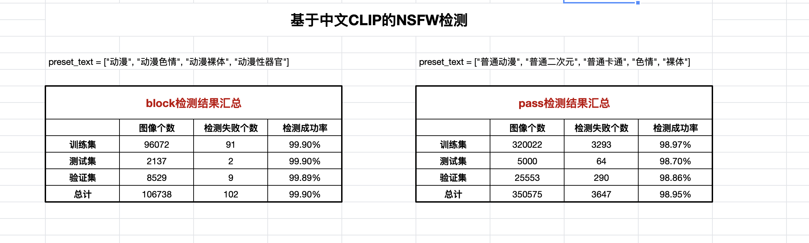

# 3D Inpainting Implementation
<p align="center">
	
</p>

This is a PyTorch/GPU re-implementation of the paper 
<a href="https://arxiv.org/abs/2211.09117">MAGE: MAsked Generative Encoder to Unify Representation Learning and Image Synthesis</a>:

```
@article{li2022mage,
  title={MAGE: MAsked Generative Encoder to Unify Representation Learning and Image Synthesis},
  author={Li, Tianhong and Chang, Huiwen and Mishra, Shlok Kumar and Zhang, Han and Katabi, Dina and Krishnan, Dilip},
  journal={arXiv preprint arXiv:2211.09117},
  year={2022}
}
```

This is results videos:
<table class="center">
<tr>
  <td style="text-align:center;">dolly-zoom-in</td>
  <td style="text-align:center;" colspan="3">swing</td>
</tr>
<tr>
  <td></td>
  <td></td>
</tr>
<tr>
  <td width=25% style="text-align:center;color:gray;">"A man is skiing"</td>
  <td width=25% style="text-align:center;">"Spider Man is skiing on the beach, cartoon style”</td>
  <td width=25% style="text-align:center;">"Wonder Woman, wearing a cowboy hat, is skiing"</td>
  <td width=25% style="text-align:center;">"A man, wearing pink clothes, is skiing at sunset"</td>
</tr>

<tr>
  <td></td>
  <td></td>
  <td></td>              
  <td></td>
</tr>
<tr>
  <td width=25% style="text-align:center;color:gray;">"A rabbit is eating a watermelon"</td>
  <td width=25% style="text-align:center;">"A rabbit is eating a pizza"</td>
  <td width=25% style="text-align:center;">"A puppy is eating an orange"</td>
  <td width=25% style="text-align:center;">"A tiger is eating a watermelon"</td>
</tr>

<tr>
  <td></td>
  <td></td>
  <td></td>              
  <td></td>
</tr>
<tr>
  <td width=25% style="text-align:center;color:gray;">"A jeep car is moving on the road"</td>
  <td width=25% style="text-align:center;">"A Porsche car is moving on the beach"</td>
  <td width=25% style="text-align:center;">"A car is moving on the road, cartoon style"</td>
  <td width=25% style="text-align:center;">"A car is moving on the snow"</td>
</tr>

<tr>
  <td></td>
  <td></td>
  <td></td>              
  <td></td>
</tr>
<tr>
  <td width=25% style="text-align:center;color:gray;">"A man is dribbling a basketball"</td>
  <td width=25% style="text-align:center;">"Trump is dribbling a basketball"</td>
  <td width=25% style="text-align:center;">"Iron Man is dribbling a basketball"</td>
  <td width=25% style="text-align:center;">"A monkey is dribbling a basketball"</td>
</tr>

<tr>
  <td></td>
  <td></td>
  <td></td>              
  <td></td>
</tr>
<tr>
  <td width=25% style="text-align:center;color:gray;">"A lion is roaring"</td>
  <td width=25% style="text-align:center;">"A tiger is roaring"</td>
  <td width=25% style="text-align:center;">"A lion is roaring, Van Gogh style"</td>
  <td width=25% style="text-align:center;">"A wolf is roaring in New York City"</td>
</tr>
</table>